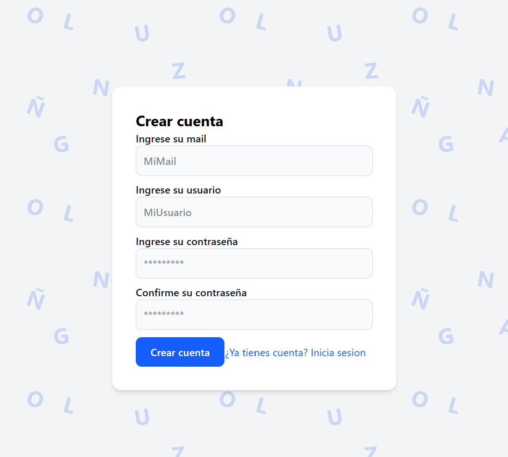
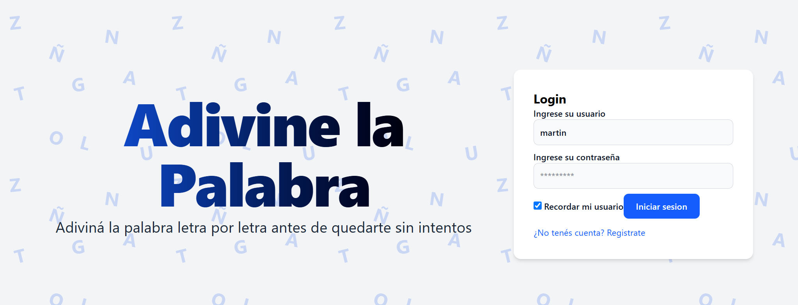
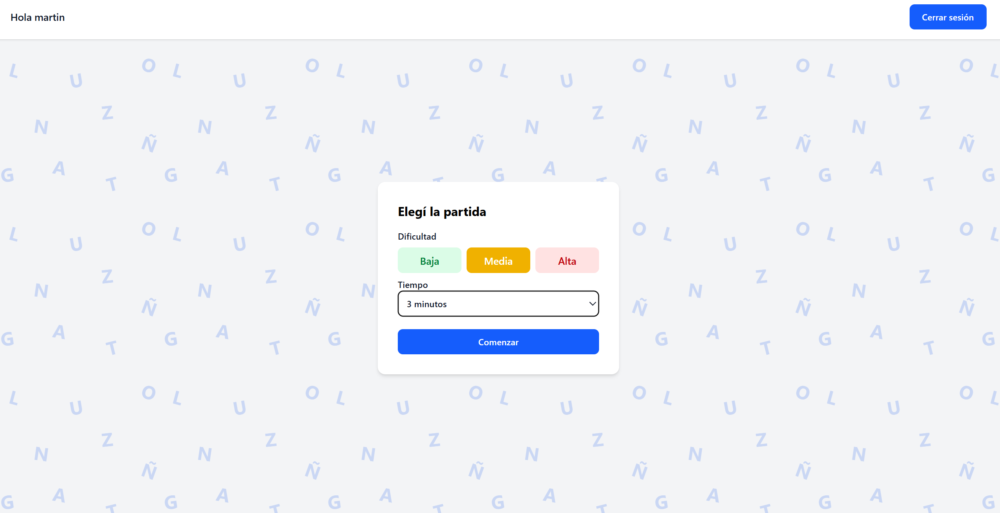
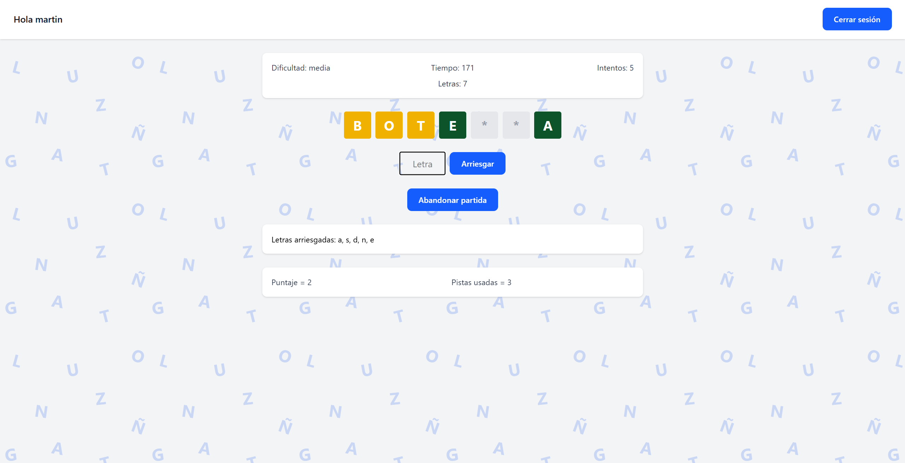
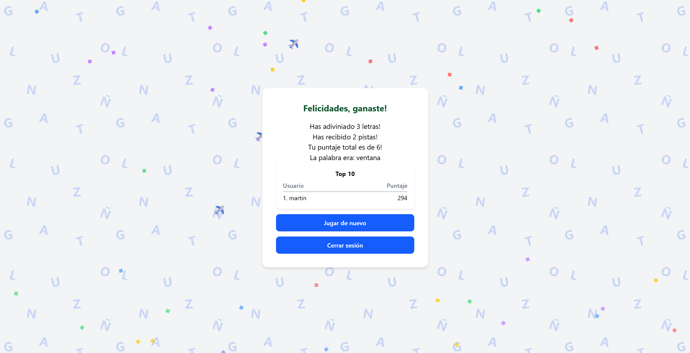

# Manual del usuario — Adivine la Palabra

*Adivine la Palabra* es un juego web en el que el jugador debe descubrir una
palabra oculta ingresando letras de a una. Este manual explica cómo usar la
aplicación paso a paso.

---

## 1. Registro

Para poder jugar hay que estar registrado. En la pantalla de inicio, hacer clic
en **"¿No tenés cuenta? Registrate"**.

Completar:

- **Mail:** una dirección de correo electrónico.
- **Usuario:** el nombre con el que se va a jugar (no puede repetirse con otro
  usuario ya existente).
- **Contraseña** (dos veces, para confirmar que coincidan).

Al presionar **"Crear cuenta"**, si los datos son válidos, la aplicación vuelve
a la pantalla de inicio de sesión.

---

## 2. Inicio de sesión

En la pantalla principal, ingresar **usuario** y **contraseña**.

- Si se tilda la casilla **"Recordar mi usuario"**, la próxima vez que se abra
  la aplicación el nombre de usuario aparecerá cargado automáticamente.
- Si los datos son incorrectos, aparece un mensaje de error en rojo.

Al iniciar sesión correctamente, se accede a la pantalla de selección de
partida.

---

## 3. Elegir una partida

Antes de jugar, hay que configurar la partida:

- **Dificultad:** determina el largo de la palabra a adivinar.
  - **Baja:** palabras de 3 a 5 letras.
  - **Media:** palabras de 6 a 8 letras.
  - **Alta:** palabras de más de 8 letras.
- **Tiempo:** la partida puede ser **sin límite** o con un tiempo de **1, 3 o 5
  minutos**.

Al presionar **"Comenzar"**, empieza la partida.

---

## 4. Cómo jugar

La palabra a adivinar se muestra **enmascarada**: cada letra oculta aparece
como un asterisco (`*`).

Para jugar, escribir una letra en el casillero y presionar **"Arriesgar"**:

- **Si la letra está en la palabra:** se descubren todas sus apariciones (las
  casillas se pintan de **verde**) y el jugador suma **un punto** a las letras
  adivinadas. El jugador mantiene el turno y puede seguir arriesgando.
- **Si la letra no está:** la aplicación descubre automáticamente una **pista**
  (revela la primera letra todavía oculta, y todas sus apariciones, pintadas de
  **amarillo**) y suma **un punto** a las pistas.

En todo momento, la pantalla muestra la información de la partida:

- **Dificultad** de la palabra.
- **Tiempo** restante (o "Sin límite").
- Cantidad de **intentos** realizados.
- Cantidad de **letras** que tiene la palabra.
- Lista de **letras arriesgadas**.
- **Puntaje** (letras adivinadas) y **pistas usadas**.

---

## 5. Abandonar la partida

Durante la partida, el botón **"Abandonar partida"** permite salir. Al
abandonar, la partida se considera **perdida** y no se acumulan puntos.
(El mismo efecto ocurre si se acaba el tiempo en una partida cronometrada.)

---

## 6. Fin de la partida

La partida termina cuando se descubren todas las letras. Se muestra el
resultado:

- **Gana** el jugador si adivinó **más letras** que las pistas que le dio la
  aplicación.
- Es **empate** si la cantidad de letras adivinadas es **igual** a la de pistas.
- **Pierde** si las pistas superan a las letras adivinadas.

Si gana o empata, el puntaje obtenido se **acumula**, multiplicado según la
dificultad: **baja ×1, media ×2, alta ×3**.

---

## 7. Ranking

Al terminar cada partida, en la misma pantalla de resultado se muestra el
**top 10** de jugadores con más puntaje acumulado entre todas sus partidas
(ver la imagen anterior).

Desde esta pantalla se puede **jugar de nuevo** o **cerrar sesión**.
